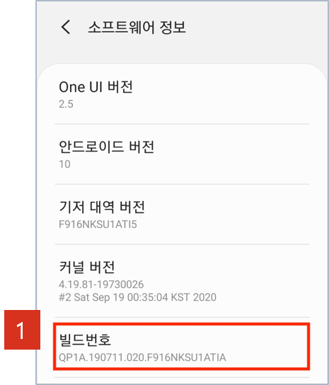
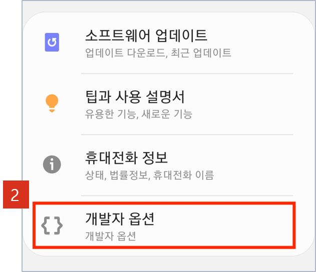
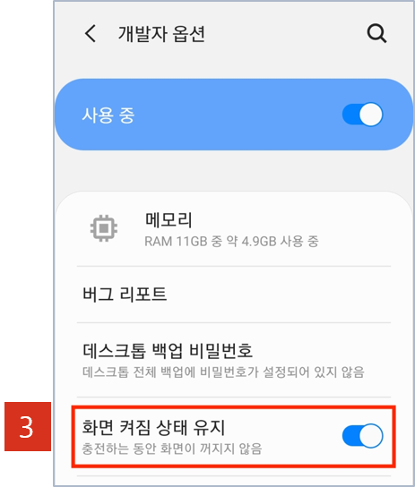

 
    
### ※ 시험 전 체크리스트_2    
---
#### **※본 매뉴얼을 응시 장소에 미리 셋팅 후 시험 응시 전 확인 사항 반드시 체크 부탁드립니다.**    
체크리스트|관련 매뉴얼
----------|-----------
자택에서 응시할 준비가 되었나요?   - 08:00 ~ 13:00 재택근무, 13:00 ~ 17:00 교육근태 적용 (0.5日)||-
응시 장소는 가이드에 적합한 장소인가요?   - 독립된 공간이며 네트워크 환경(PC&휴대폰)이 안정적인 공간|6 page
PC와 휴대폰은 안내받은 브라우저/앱으로 접속하였나요?   - PC : 크롬 브라우저   - Android : 크롬 어플리케이션   - iOS : 사파리 어플리케이션|6 page
책상 위에 시험 응시에 허용된 기기 이외의 불필요한 물건은 없나요?   - 태블릿PC, 이어폰, 웨어러블 기기 등 통신이 가능한 전자 기기를    포함하여 부정행위로 간주될 수 있는 물건의 비치 또는 사용 불가   ※ 단, 2교시 실기 검정 中 통신의 기능이 없는 지면 서책 및 필기 용지 등은 허용    (1교시 필기 검정 中에는 모두 불가)|6 page 
PC 및 휴대폰은 충전기/전원케이블과 연결하였나요?|11 page
웹캠과 휴대폰은 안내받은 각도로 연결되었나요?|11 page
규정 신분증을 준비했나요?   - 주민등록증 / 운전면허증 / 여권 허용|18 page
     
    
### ※ 필기 / 실기 시험 유의사항_3
---
#### **※모든 문의는 응시 플랫폼 감독관 채팅을 통해 이루어집니다.(휴대폰 임의 조작 금지)**
구분|필기|실기
---------|---|-----
접속방법||메일 본문 링크 접속(https://hdat.elice.io)|
응시 전 확인|① 시험 응시 관련 안내 메일(현대엔지비) 개인 메일로 전달 [BR] ② 이메일, 통화, 메신저 등 부정행위 가능 프로그램 종료 [BR] ③ VPN 등 보안 관련 프로그램 종료 [BR] ④ 신분증, 웹캠, 휴대폰 충전기 등 환경 세팅]     
응시 중 검색/자료 참고|불가(백지와 필기구만 허용)|가능    
제출물|없음|문항별 별도 파일    
제출 방법|응시 플랫폼에서 답안 체크 후 "시험 종료" 버튼 클릭시 자동 제출|실습 문제 內 csv 파일 생성 코드 실행 (Jupyter notebook 기반)    
부정행위 기준|① 타인과 의사소통 [br] ② 문제 및 데이터 반출 의심 행위(숨겨진 셀 확인, 데이터 다운로드 등) [br] ③ 종료시간 이후 수정(마지막 수정 시간 기준) [br] ④시험 응시에 필요한 행동 外 행동은 부정행위로 간주될 수 있습니다.
     
    
### ※ 응시 프로세스_4
---
> **각 단계별 응시 매뉴얼 숙지 必**
     
    
### ※ 응시 시간표_5
---
> **접속 시간 준수 必**
     
    
구분|시간|내용|비고
---|----|----|-----
1교시|13:00 ~ 13:10 [br] (10분)|필기검정 준비|응시 사이트 접속 [br] [https://hdat.elice.io](https://hdat.elice.io)
1교시|13:10 ~ 14:00 [br] (50분)|필기 검정 - 객관/단답형 | 10문항
2교시|14:00 ~ 14:10 [br] (10분)|쉬는 시간 및 실기 검정 준비|응시 사이트 접속 [br] [https://hdat.elice.io](https://hdat.elice.io)
2교시|14:10 ~ 17:00 [br] (170분)|실기 검정Ⅰ – 프로세스형|**1파일 내 8문제**
2교시|14:10 ~ 17:00 [br] (170분)|실기 검정Ⅱ - 문제해결형|**1파일 내 1문제**
     

### 2. 휴대폰 필수 설정 사항_8    
> 화면 잠금 해제 방법
- case1) 안드로이드 휴대폰 사용시

 [화면 켜집 상태 유지 방법] 

 
 

① 설정 > 휴대전화 정보 > 소프트웨어 정보 메뉴로 이동 [br]
② [빌드번호] 연속으로 7회 이상 터치한 후, ＂개발자 모드를 켰습니다.＂ 메시지 확인 [br] ※ 경우에 따라 기기 암호 입력 要     
③ 설정 > 휴대전화 정보 아래 개발자 옵션 메뉴로 이동    
④ 화면 켜짐 상태 유지 활성화    

### 4. 화상 감독 연결_21
---
⑧ 채팅 및 공지사항 확인    
    **※ 시험 시작 전 좌측 하단 채팅을 통한 감독관 문의 및 전체 공지사항 확인이 가능합니다.**
